# Architecture

Go single-binary CLI+TUI for managing multi-repo dev environments via tmux.

## Layer Diagram

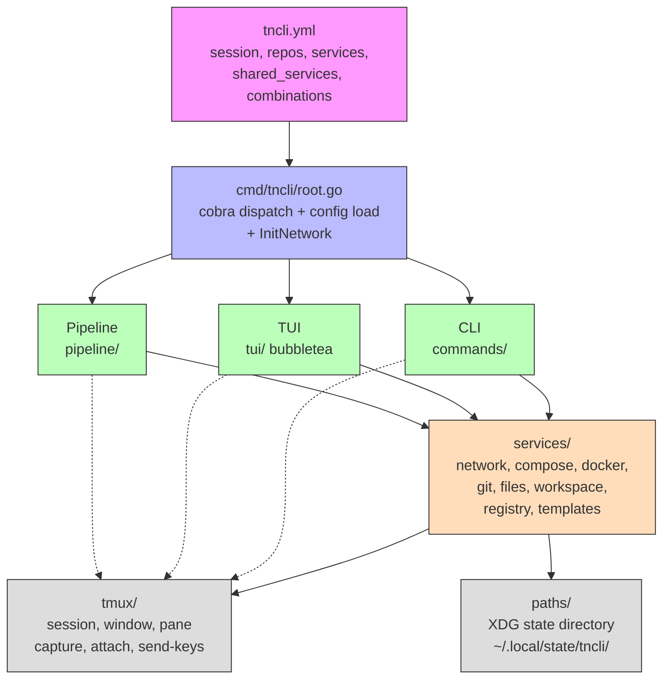

## Data Flow

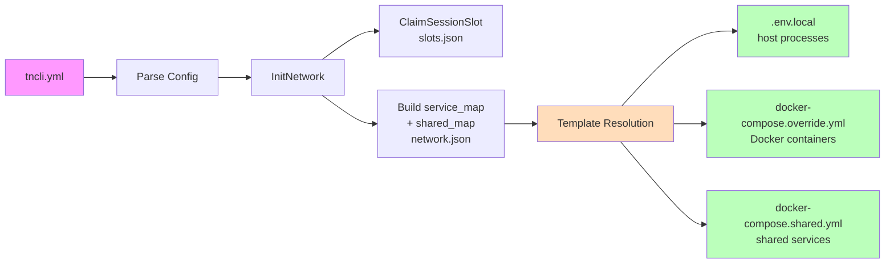

## Port Allocation

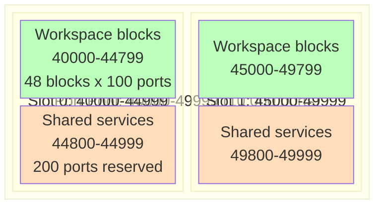

Formulas:
- **Workspace service**: `PoolStart + slot * SlotSize + blockIdx * BlockSize + svcIdx`
- **Shared service**: `PoolStart + slot * SlotSize + SlotSize - SharedReserve + offset`
- **Multi-port**: consecutive offsets per service
- **Multi-instance** (capacity): `SharedPort(name) + instanceIdx`

## Networking

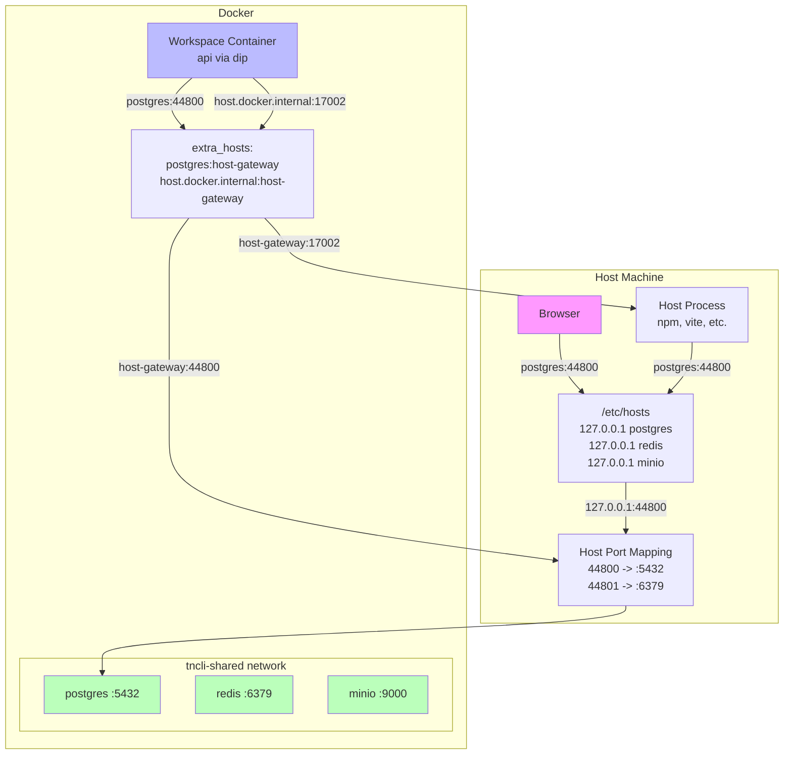

## Workspace Create Pipeline

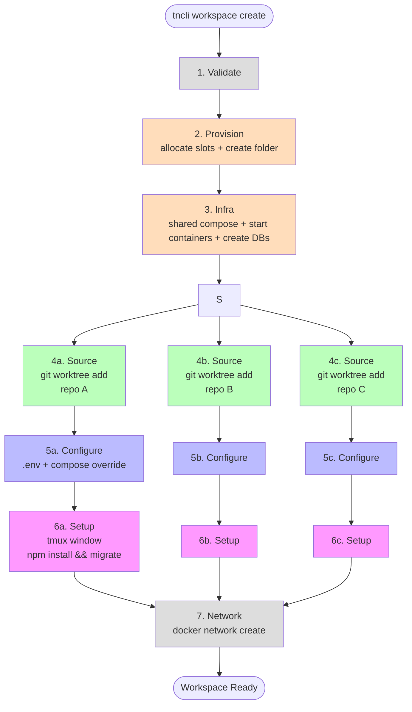

## Workspace Delete Pipeline

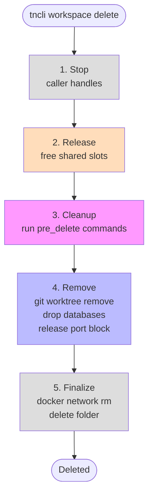

## Migrate Pipeline

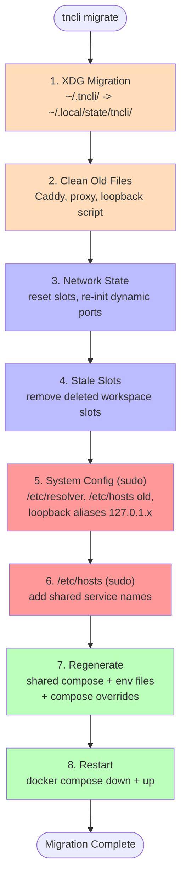

## Template Resolution

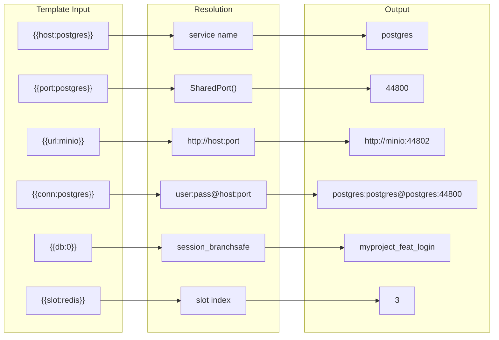

## Dependency Graph

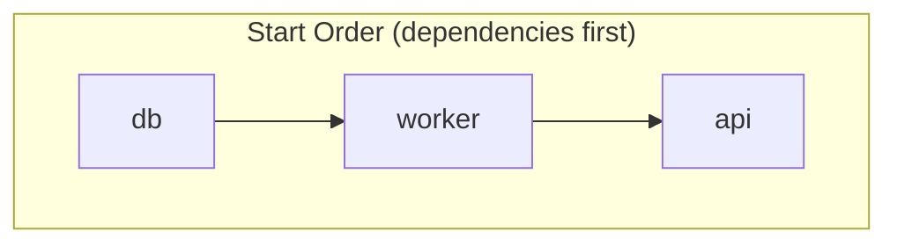

```yaml
services:
  api:
    cmd: dip server
    depends_on: [worker]
  worker:
    cmd: dip sidekiq
    depends_on: [db]
  db:
    cmd: dip db
```

Kahn's toposort with cycle detection. Start: dependencies first. Stop: reverse.
Transitive: requesting `api` auto-starts `worker` and `db`.

## Interfaces

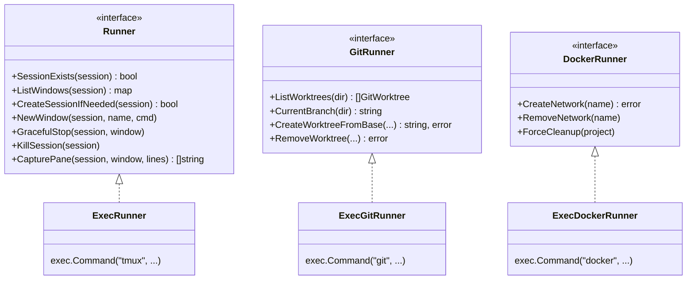

## State Files

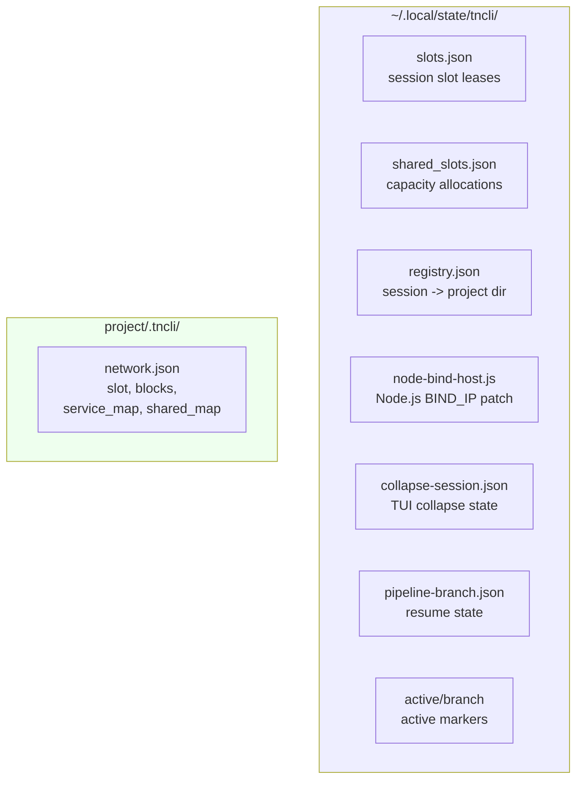
